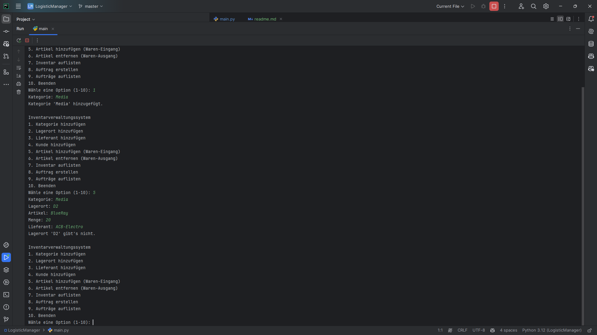
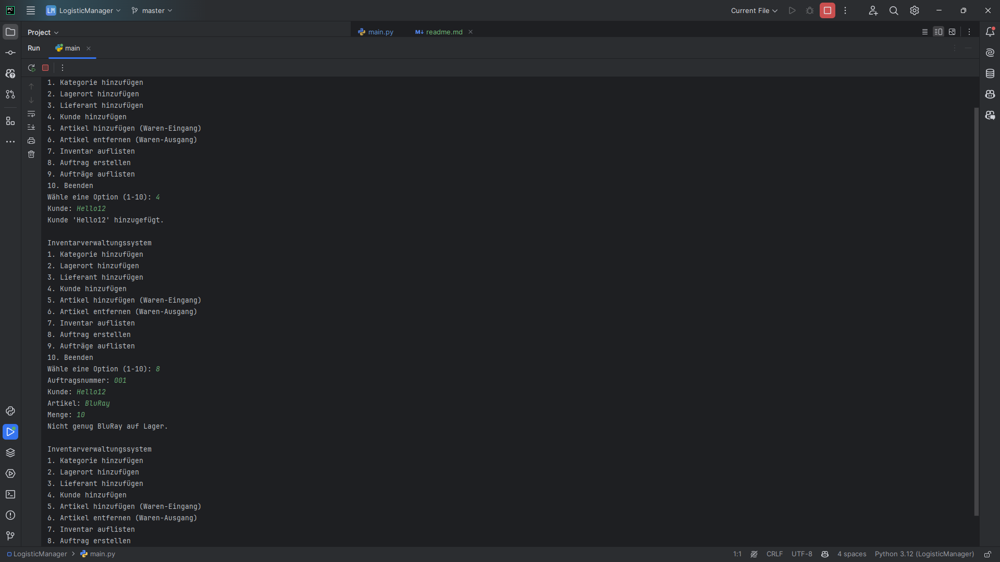
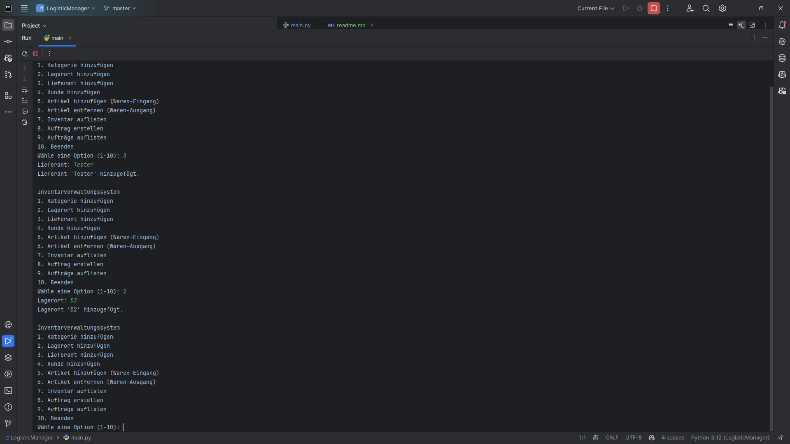
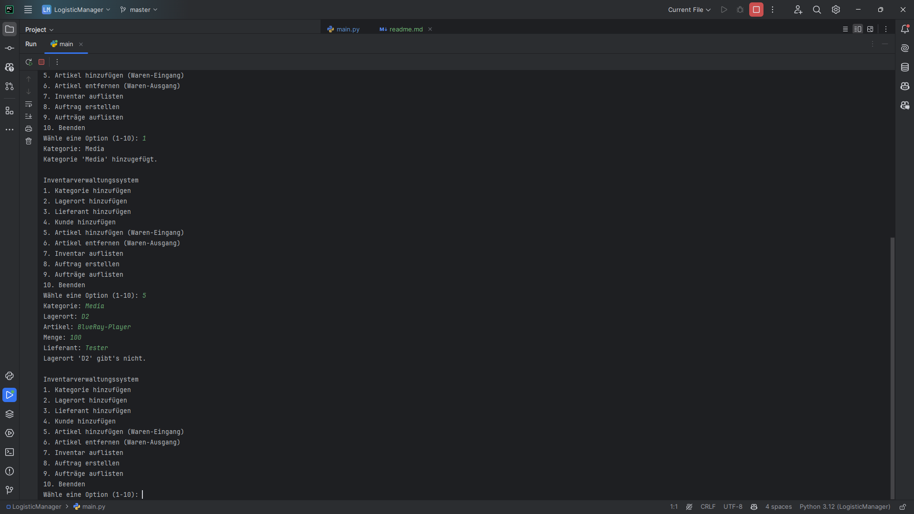
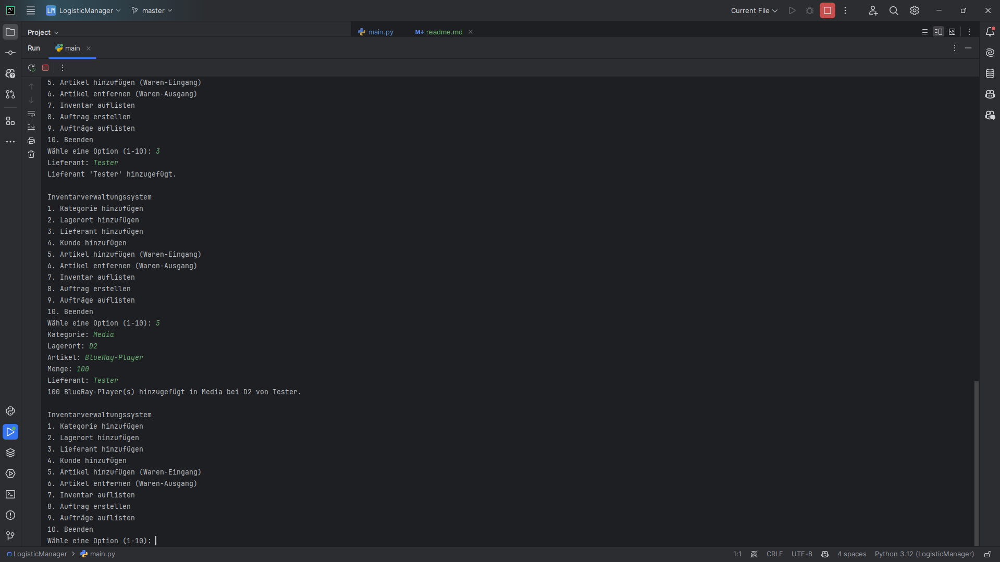
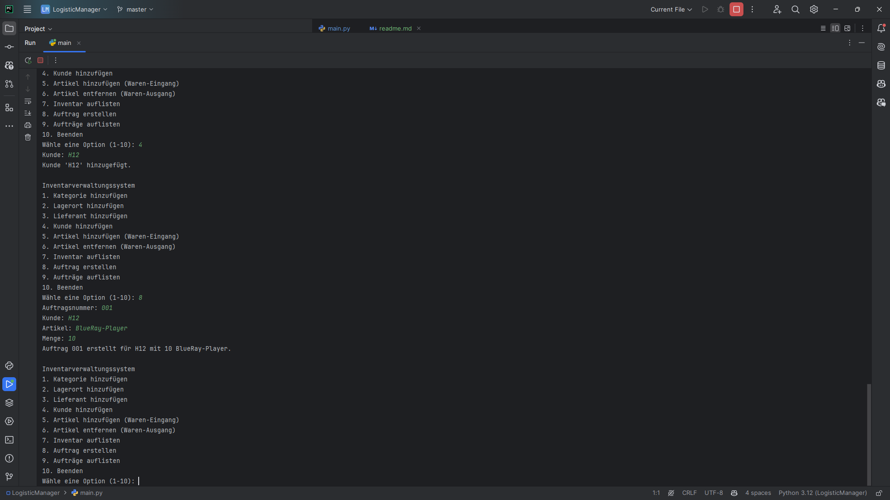
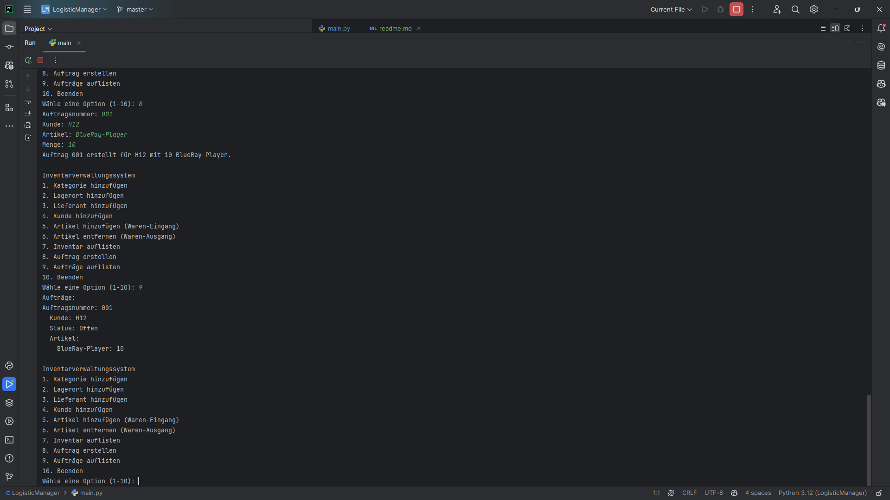

# Inventory and Order Management System

## Description
This is a little system to manage inventory and orders. With Supplier and customer.

## Usage
### Add a Category
1. Select "Add Category".
2. Enter the name of the category.

### Add a Location
1. Select "Add Location".
2. Enter the name of the location.

### Add a Supplier
1. Select "Add Supplier".
2. Enter the name of the supplier.

### Add a Customer
1. Select "Add Customer".
2. Enter the name of the customer.

### Add Item (Goods Receipt)
1. Select "Add Item (Goods Receipt)".
2. Enter the category, location, item name, quantity, and supplier.

### Remove Item (Goods Dispatch)
1. Select "Remove Item (Goods Dispatch)".
2. Enter the category, location, item name, quantity, and customer.

### List Inventory
1. Select "List Inventory".
2. The inventory will be listed by categories and locations.
3. Suppliers and customers will also be displayed.

### Create Order
1. Select "Create Order".
2. Enter the order number, customer name, item, and quantity.
3. The order will be created if the customer exists and there is enough stock.

### List Orders
1. Select "List Orders".
2. All existing orders will be listed, including order number, customer, item, and status.

## Installation
1. Clone the repository.
2Run `python main.py` to start the program.

## Preview
  
  
  
  
  
  
  
